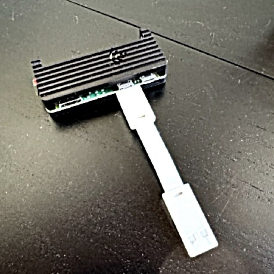

# zerokb

A USB HID keyboard emulator that runs on a Raspberry Pi Zero 2W. It receives text over TCP and types it on the host machine via USB, as if a physical keyboard were connected. The host sees a standard USB keyboard and nothing else. No drivers, no software, no permissions required on the host.



## How it works

1. The Pi Zero is plugged into the host machine's USB port
2. The host enumerates it as a generic USB keyboard
3. zerokb listens on TCP port 7070
4. Any text sent to that port is typed on the host, character by character, as real HID keystrokes

The entire pipeline is: `TCP byte in -> USB HID scancode out`. There is no buffering, no protocol overhead, no dependencies. Each byte is typed the instant it arrives.

## What it supports

- Full US keyboard layout (a-z, A-Z, 0-9, all punctuation)
- Ctrl+A through Ctrl+Z
- Enter, Tab, Backspace
- Any host OS (macOS, Linux, Windows) -- it's a keyboard, not a driver

## Requirements

### Hardware

- Raspberry Pi Zero 2W (or any Pi with a USB OTG-capable port)
- USB cable: Micro USB (data port on Pi) to whatever the host takes
- WiFi network accessible from the sending machine

The Pi Zero 2W has two Micro USB ports. Use the one labeled **USB**, not **PWR**. The USB port carries both data and power.

### Build machine

- Rust toolchain (`rustup`)
- `cargo-zigbuild` and `zig` for cross-compilation
- Ansible for deployment

```
rustup target add armv7-unknown-linux-gnueabihf
brew install zig
cargo install cargo-zigbuild
```

### Pi Zero

- Raspberry Pi OS Lite (Bookworm, 32-bit)
- SSH access
- Python 3 (for Ansible)

## Setup

Edit `ansible/inventory.yml` with your Pi's IP and SSH user.

First-time deployment (will prompt for the Pi's sudo password once, then configure passwordless sudo for future deploys):

```
make setup
```

This builds the ARM binary, copies it to the Pi, configures the USB HID gadget, installs systemd services, enables the hardware watchdog, sets journald to volatile, disables unnecessary services, and pins WiFi to avoid roaming drops.

After the first time:

```
make
```

## Usage

Plug the Pi into the host machine's USB port. It boots, connects to WiFi, and starts listening.

Send text from any machine on the network:

```
echo "hello" | nc <pi-ip> 7070
```

Or use the included TUI for interactive testing:

```
make install    # installs zerokb-tui to ~/.cargo/bin
zerokb-tui
```

The TUI connects to the Pi, puts your terminal in raw mode, and forwards every keystroke over TCP. Double Ctrl-C to quit. It will refuse to run on the machine the Pi is plugged into, to prevent a feedback loop.

## How it boots

The Pi is configured for fast, reliable boot:

| Optimization | Effect |
|---|---|
| Disabled Bluetooth, ModemManager, avahi, swap, getty | ~5s off boot |
| WiFi power save disabled | No latency spikes or dropped packets |
| BSSID pinned | No roaming between mesh nodes |
| Volatile journald (16MB, RAM only) | No SD card writes during operation |
| Hardware watchdog (bcm2835) | Auto-reboot on hang |
| systemd watchdog (30s) | Auto-restart on process hang |
| `Restart=always`, `RestartSec=1` | Bounces back in 1 second |

The Pi reaches the TCP listener ~7 seconds after power on.

## USB identity

The gadget identifies as a Keychron V3 keyboard (VID `0x3434`, PID `0x0333`). This can be changed in `scripts/hid-setup.sh`. Using a known keyboard identity avoids the macOS Keyboard Setup Assistant on first connection.

## Project structure

```
zerokb/
├── src/
│   ├── main.rs             # TCP listener, HID report writer, watchdog
│   ├── keymap.rs           # US keyboard HID scancodes with tests
│   └── bin/test-typing.rs  # TUI client (ratatui)
├── scripts/
│   └── hid-setup.sh        # USB gadget descriptor (libcomposite)
├── systemd/
│   ├── zerokb-hid.service  # Creates /dev/hidg0 on boot
│   └── zerokb.service      # TCP listener daemon
├── ansible/
│   ├── inventory.yml
│   ├── deploy-zerokb.yml   # Full deployment playbook
│   └── upgrade.yml         # System upgrade playbook
├── Cargo.toml
├── Makefile
└── docs/
    └── pizero2w.jpg
```

## Makefile targets

| Target | What it does |
|---|---|
| `make` | Build ARM binary and deploy to Pi |
| `make setup` | First-time deploy (prompts for sudo password) |
| `make build` | Cross-compile only |
| `make install` | Install `zerokb-tui` locally |
| `make upgrade` | Update Rust deps, deploy, apt upgrade the Pi |
| `make test` | Run unit tests |
| `make check` | cargo check + clippy |
| `make clean` | Remove build artifacts |

## Binary size

The release binary is ~340KB, stripped, with LTO. It uses ~3MB of RAM at runtime.

## License

MIT
